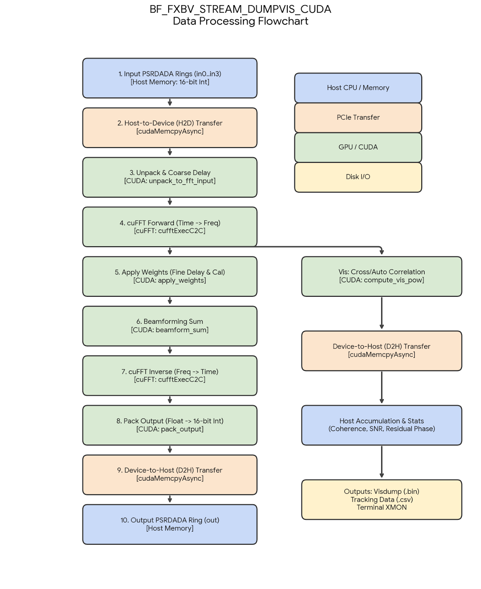
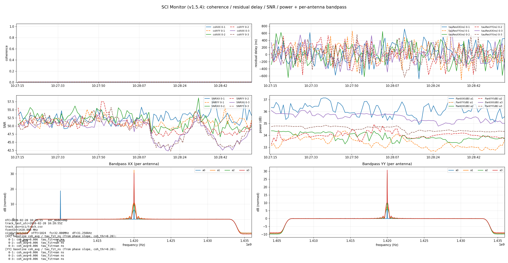
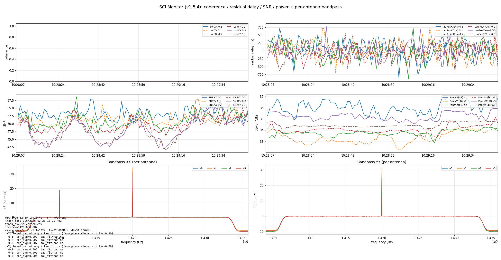
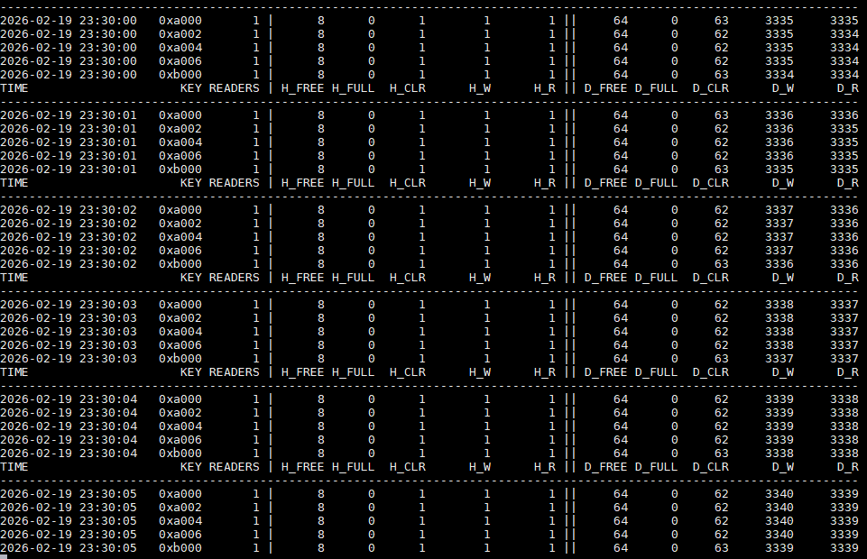
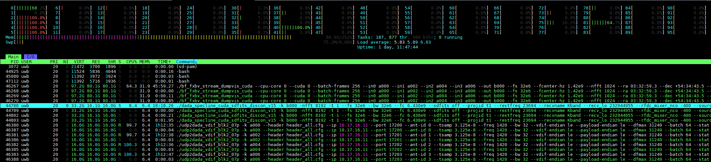
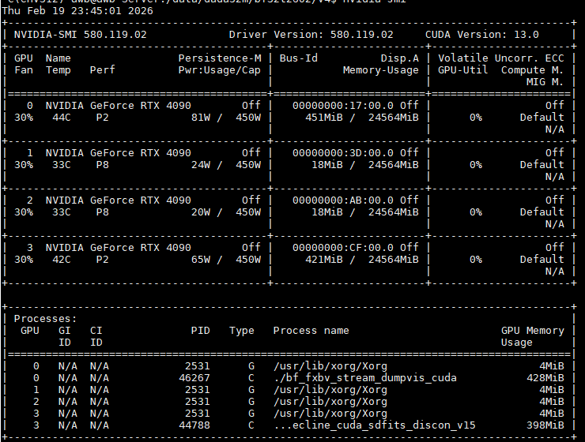
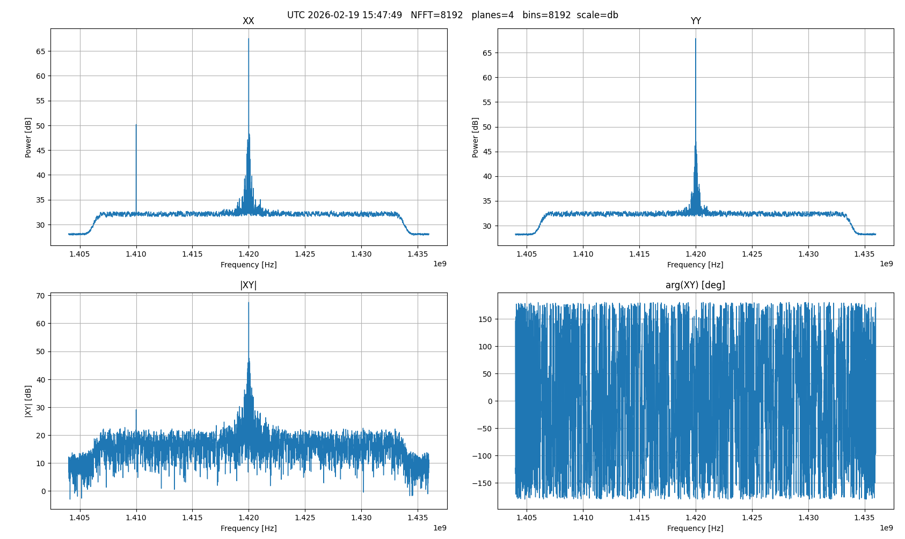
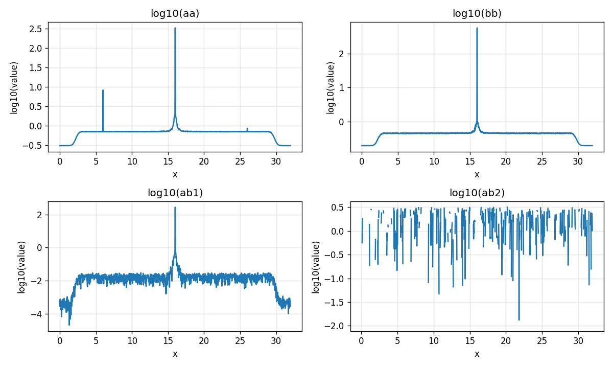
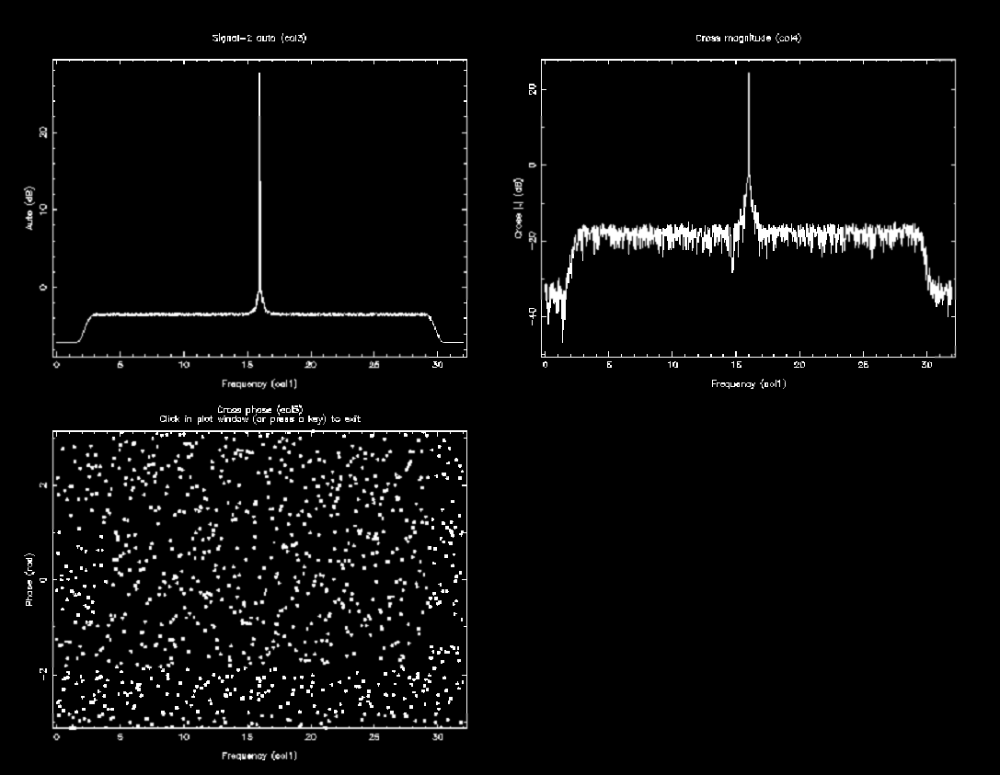

说明

1. 数据摄入与传输（Host -> GPU）
数据读取：程序从最多 4 个 PSRDADA 环形缓冲区（in0 到 in3）中批量读取数据。每个帧由交织的 16 位整型数据（Xre, Xim, Yre, Yim）组成。
H2D 传输：将批量的原始数据通过 cudaMemcpyAsync 异步传输到 GPU 设备内存（d_in）。

2. 预处理与时频转换（Time -> Freq）
CUDA Kernel - unpack_to_fft_input：这是 GPU 上的第一步，主要是对 16 位整型数据进行解包，将其转换为单精度浮点复数（cufftComplex/float2）。同时，该核函数负责施加整数级粗延迟（Coarse Delay）。
cuFFT Forward：调用 NVIDIA cuFFT 库执行 C2C（复数到复数）的一维前向傅里叶变换，将时域信号转换为频域信号。

3. 相位补偿与权重应用
CUDA Kernel - apply_weights：在频域中对信号进行操作。在此应用分数级精细延迟（Fine Delay）、条纹旋转（Fringe Stopping 相位补偿），以及如果提供了 --calfile，则应用每个天线、每个偏振、每个通道的复数校准权重。

4. 数据流分叉点（Main Pipeline vs Visibility Branch）
此时，频域数据分流进入两条链路：

链路 A：核心波束成形（主干道）
CUDA Kernel - beamform_sum：对经过延迟补偿和权重校准的所有激活天线的信号进行相干求和，并进行归一化处理。

cuFFT Inverse：对求和后的频域数据执行逆向傅里叶变换（IFFT），将波束成形后的信号转换回时域。

CUDA Kernel - pack_output：将浮点时域信号重新打包、裁剪限幅为 16 位整型（int16）格式。

D2H 传输与输出：将打包好的数据拷贝回主机内存，最终写入到目标的 PSRDADA 输出环形缓冲区（out）。

链路 B：可见度与监控（旁路）
CUDA Kernel - compute_vis_pow：利用频域数据，计算选定基线（Baseline）的交叉功率谱（Cross-power）和自功率谱（Auto-power/Visibilities）。

D2H 传输与主机累加：将功率谱数据拷回主机，在主机端累加跨度为 monitor_sec（通常为 1 秒）的数据。

监控与持久化：主机通过相干度（Coherence）、信噪比（SNR）、残差延迟等指标评估信号质量，并将结果输出到终端日志（XMON），或写入 Visdump 二进制文件（.bin）及跟踪记录文件（.csv）。

开启相位补偿

关闭相位补偿

dada缓冲区监测

CPU情况

GPU情况

实时记录SDFITS监测

2bit压缩基带VDIF 测试

